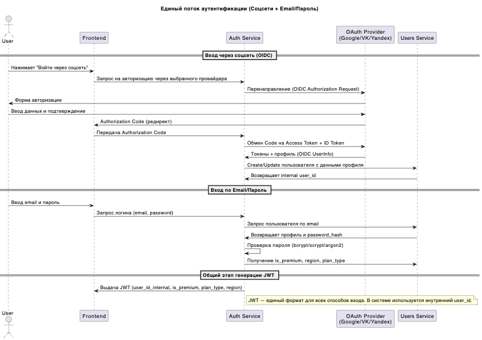
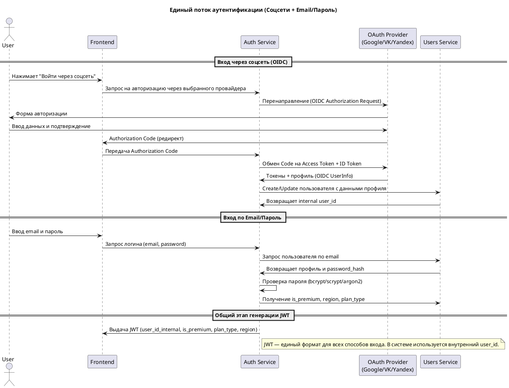
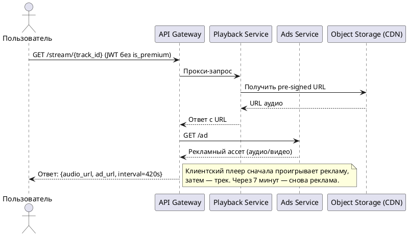
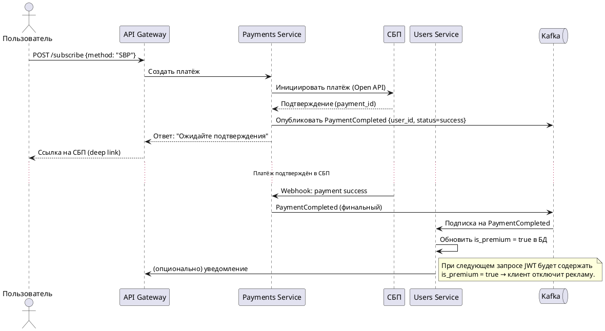
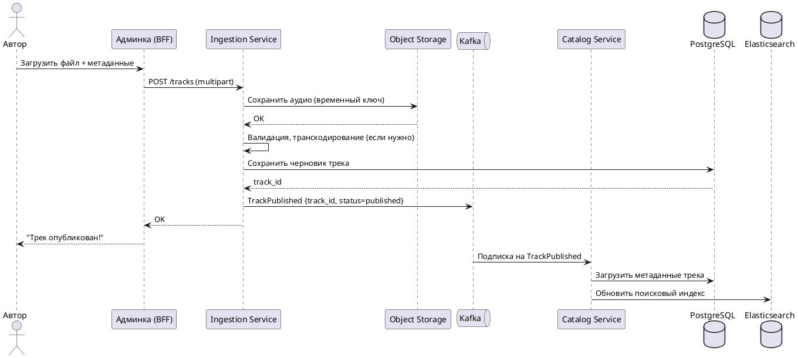
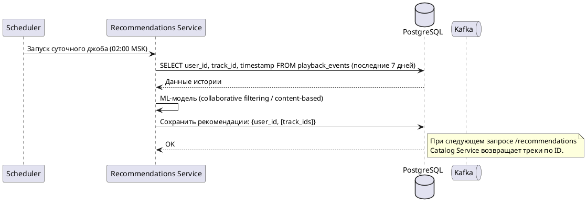

# Вид выполнения (сценарии использования)

Ниже описаны ключевые сценарии взаимодействия компонентов в runtime. Каждый сценарий соответствует одной или нескольким [user story](./03_system_scope_and_context.md#user-story) и отражает поведение системы в production-условиях.

## Сценарий 0: Пользователь инициирует вход (Аутентификация)

**Связанные user story:** №12

> **Через Соцсети (Google, VK, Yandex)**
> 
> **Описание:** Пользователь нажимает кнопку "Войти через соцсеть" на фронтенде, система перенаправляет его на страницу авторизации выбранного провайдера (Google, VK, Yandex)
> 
> **Через Email + Пароль**
> 
> **Описание:** Пользователь вводит email и пароль, система проверяет учетные данные и возвращает JWT.






> Два способа аутентификации идут в параллели верхней части схемы.
> 
> Auth Service всегда работает через Users Service:
>   - для соцсетей — создаёт/обновляет профиль;
>   - для email — получает профиль и хэш пароля.

> JWT генерируется по единому стандарту:

```json
{
  "sub": "user_id_internal",
  "is_premium": false,
  "plan_type": "basic",
  "region": "RU",
  "exp": 1700000000
}
```

> Остальные микросервисы даже не знают, каким способом пользователь входил — смотрят только на claims в JWT.

## Сценарий 1: Пользователь слушает трек (free-аккаунт)

**Связанные user story**: №2, №6

**Описание**: Пользователь без премиум-подписки запрашивает воспроизведение трека. Система возвращает URL аудиофайла и рекламного ассета каждые 7 минут.


> Примечание: Решение о показе рекламы принимается на стороне клиента на основе отсутствия флага is_premium в JWT.

## Сценарий 2: Пользователь оформляет премиум-подписку

**Связанные user story:** №7, №8

**Описание:** Пользователь инициирует оплату через СБП. После успешного платежа его статус обновляется, и он получает доступ без рекламы.



## Сценарий 3: Автор загружает новый трек через админку

**Связанные user story:** №10, №11

**Описание:** Автор загружает аудиофайл и метаданные. Трек сохраняется, обрабатывается и публикуется в каталоге через событие.



>  Трек становится доступен в поиске и каталоге после индексации в Elasticsearch.


## Сценарий 4: Система формирует суточные рекомендации

**Связанные user story:** №5

**Описание:** Раз в сутки запускается batch-процесс, который на основе истории прослушиваний генерирует персонализированные рекомендации.



> Важно: рекомендации не генерируются в реальном времени — это offline-батч.

