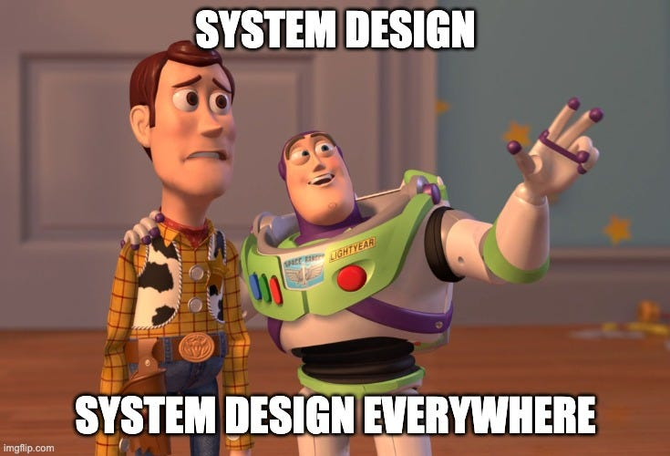
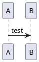

# ШОРТКАТ

## System Design

### Web. Микросервесная архитектура

#### [Практическая работа / Аналитическое хранилище + Поиск](https://shortcut.education/members/courses/course314984264484/prakticeskaa-rabota-385483827035)

* Intro

  * [План общий](./system_design_plan.md)
  * [Ревью и встречи](./review.md)

* System Design

  * [01 Сбор и анализ требований](./01_introduction_and_goals.md)
  * [02 Архитектурные ограничения](./02_architecture_constraints.md)
  * [03 Границы системы и контекст](./03_system_scope_and_context.md)
  * [05 Вид строительных блоков (микросервисы)](./05_building_block_view.md)
  * [06 Вид выполнения (сценарии использования)](./06_runtime_view.md)

## Kroki test

