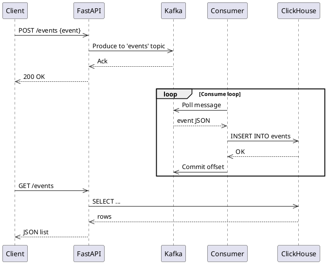

# ESS - Event Statistics Service

> Внешний сервис аналитики воспроизведений — потребляет Playback события из Kafka
> и сохраняет статистику воспроизведений в БД

## Описание

ESS это микросервис для хранения событий с использованием Python, Очередь Kafka и БД ClickHouse.

Этот сервис должен обеспечивать обработку и сохранение событий, поступающих от различных источников, с возможностью быстрого анализа данных.

### Основные требования к системе

Эта платформа предоставляет такие возможности:

✅ Прием событий через REST API  
  
✅ Передача событий в Очередь  
  
✅ Хранение событий в ClickHouse  
  
✅ Гибкость в обработке различных типов событий  
  
✅ Масштабируемость для работы с высокими нагрузками  
  
✅ Возможность аналитики на основе хранимых данных

Дополнительные функции:

✅ Партиционирование данных
в ClickHouse для оптимизации запросов

✅ Механизм ретрансляции
событий в другие системы

✅ Механизмы ретрайов
для недоставленных сообщений

## Архитектура

[Диаграмма контейнеров (C4 Level 2)](https://nikson276.github.io/SystemDesign/#/./05_building_block_view?id=%f0%9f%93%a6-%d0%9e%d0%bf%d0%b8%d1%81%d0%b0%d0%bd%d0%b8%d0%b5-%d0%ba%d0%be%d0%bd%d1%82%d0%b5%d0%b9%d0%bd%d0%b5%d1%80%d0%be%d0%b2)

## Техническая реализация

### Запуск сервиса

Через .sh скрипт

```bash
./start.sh
```
или вручную 

```bash
# В корне ESS/
docker compose up -d          # запустить всё
docker compose --profile consumers up -d  # Запустить консьюмеры отдельно
docker compose logs -f        # смотреть логи
docker compose stats          # смотреть метрики контейнеров
docker compose down -v        # остановить и удалить данные
```

FastAPI: http://localhost:8000
Kafka UI: http://localhost:8080
ClickHouse HTTP: http://localhost:8123

### Запуск тестов

Запускаем внутри сети докер, в временном контейнере

```bash
docker compose run --rm k6
```

### Sequence Diagram: Event Flow




### Лог задач

**Цель:** Разработать черновой вариант микросервиса, обеспечивающего приём и хранение событий.

**Самостоятельно**

- [x] Развернуть Очередь и ClickHouse
- [x] Реализовать REST API, принимающий события и передающий их в Kafka
- [x] Реализовать продюсер, который отправляет тестовые события
- [x] Реализовать консьюмер, который читает события и записывает их в ClickHouse
- [x] Разработать API-эндпоинт для запроса событий из ClickHouse
- [x] Описать схемы данных и механизмы обработки событий

**С ментором**

- [x] Обсуждение архитектуры микросервиса
- [x] Изучение применимых паттернов (Event Sourcing, CQRS)
- [x] Получение обратной связи по первому варианту реализации

### Финальная доработка и презентация

**Цель:** Представить финальную версию микросервиса.

**Самостоятельно**

- [x] Доработка архитектуры на основе обратной связи
- [x] Оптимизация обработки событий и хранения данных
- [x] Подготовка финальной документации
- [x] Анализ возможных рисков и стратегий масштабирования

**С ментором**

- [ ] Защита разработанного решения
- [ ] Обсуждение возможных улучшений и дальнейшего развития системы

- Цель 3500 RPS
- Замеры моей локалки
- Потом прикинуть что можно улучшить и найти ботлнек
- Нагрузку создать через К6
- Посчитать лаг (между обработкой АПИ и записи в Кликхаус)
- Сделать доку с конфигом - и резульат из К6
- Сентри для аналитики результатов

Ревью 1 и 2:

- [x] Переключить синхронный дравер кафки на ассинхронный драйвер и перезамерить
- [x] Вернуть FastAPI на один инстанс с воркерами = ядрам (не более, тут не выйграшь)
- [x] Timeweb зарегаться и протестить на двух машинах
- [x] Замерить кафка лаг на чтение из клихауса
  - Для этого прокачать модель записи события (два тайм стемпа, ид теста )


## Load test log

### [Test log all](./ess_log_test.md)

### [Summary test results](./ess_summary.md)
